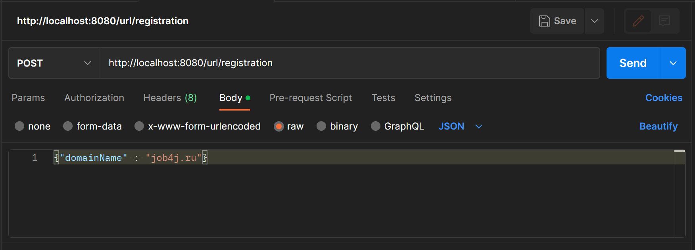
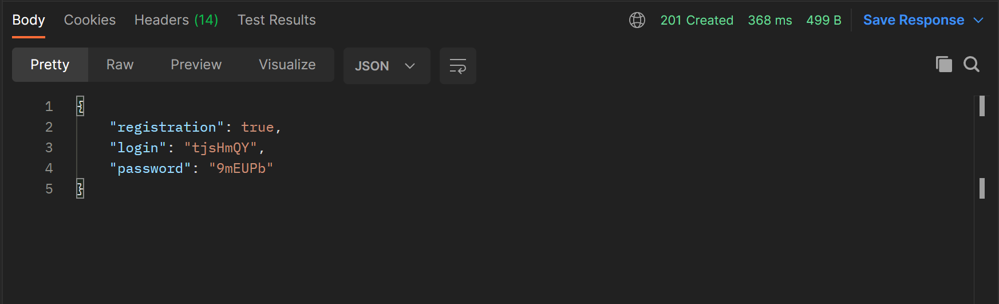
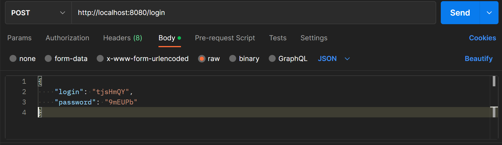
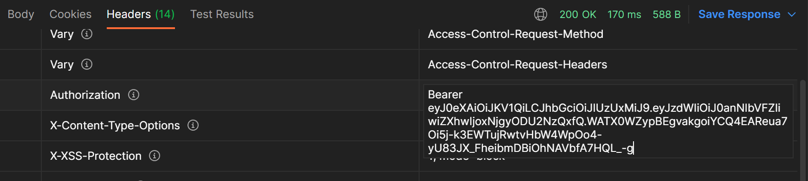
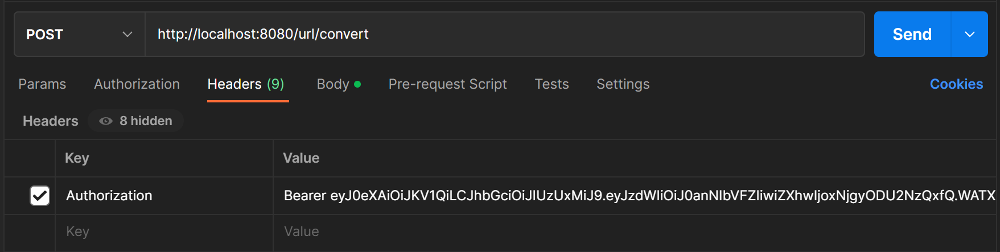
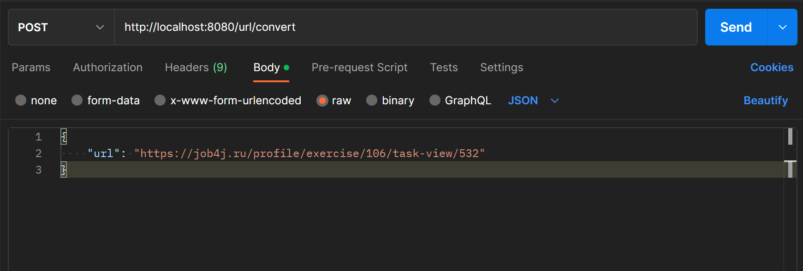
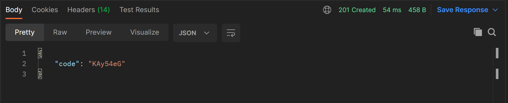
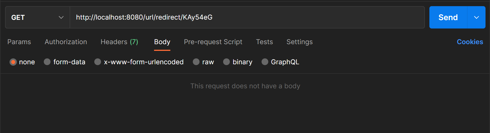
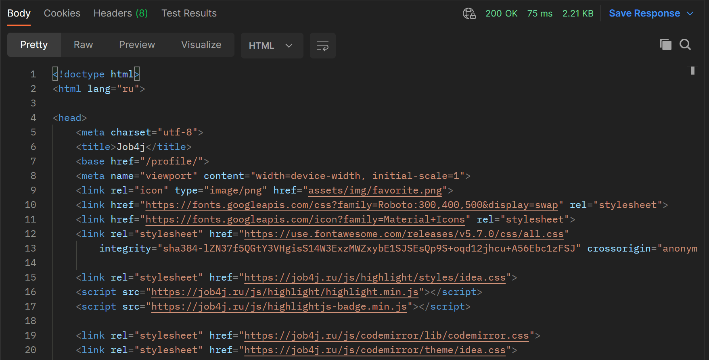
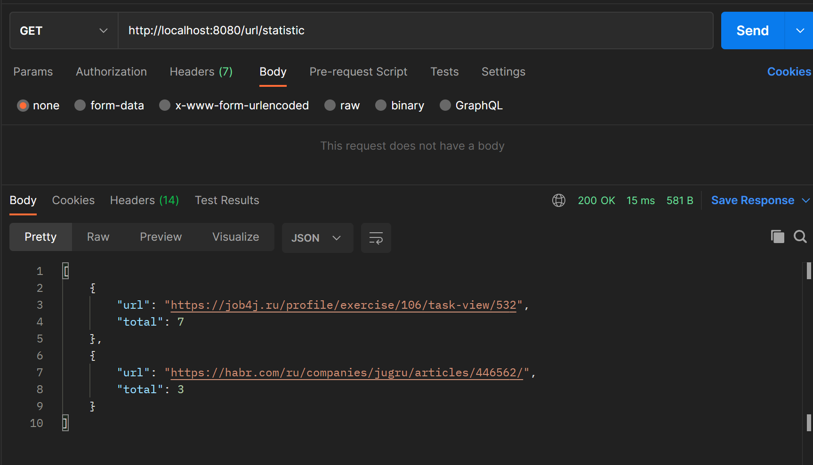

# Проект "Сервис - UrlShortCut"

## Описание проекта.

Проект представляет собой RESTful-сервис, который преобразует URL-адреса в укороченный вид. Для создания коротких ссылок
требуется регистрация, авторизация реализована через JWT. С их помощью можно отправлять запрос и в ответ получить
статистику, которая отображает все URL-адреса и количества переходов по ним.

## Стек технологий.

- **Java 17**
- **Spring Boot 2.7.10**
- **Spring Data JPA 2.7.10**
- **Spring Security 5.7.10**
- **JWT 3.4.0**
- **PostgreSQL 14**
- **Liquibase 4.15.0**
- **H2DB 2.1.214**
- **Lombok 1.18.26**
- **log4j 1.2.17**

## Требования к окружению.

- **Java 17**
- **Maven 3.8**
- **PostgresSQL 14**
- **Postman**

## Запуск проекта.

- **Создать БД**

``` shell 
create database url_shortcut;
```

- **Запустить проект по команде**

``` shell 
mvn spring-boot:run
```

- **Запустить Postman**

``` shell 
http://localhost:8080/
```

## Взаимодействие с приложением.

1. Регистрация сайта.
Сервисом могут пользоваться разные сайты. Чтобы зарегистрировать сайт в систему нужно отправить POST запрос 

``` 
POST /registration
```

c телом

```
{ "domainName": "job4j.ru" }.
```



В качестве ответа получаем сгенерированные логин и пароль.



2. Авторизация.
Авторизация выполнена через JWT. Пользователь отправляет POST запрос с полученными login и password.



В ответе будет находиться сгенерированный токен, с которым можно будет выполнять дальнейшие запросы.



3. Регистрация URL.
Перед регистрацией URL необходимо в Headers добавить колонку Authorization и в его значении указать ранее созданный
   токен.



После того, как пользователь зарегистрировал свой сайт, он может отправлять на сайт ссылки и получать преобразованные
ссылки. Для этого необходимо отправить POST запрос 

``` 
POST /convert
```

c телом

```
{"url": "https://job4j.ru/profile/exercise/106/task-view/532"}.
```



В ответе будет находиться укороченная ссылка. 



4. Переадресация. Выполняется без авторизации.
Для того, чтобы перейти на сайт, необходимо отправить GET запрос с указанием укороченный ссылки. 

``` 
GET /redirect/УНИКАЛЬНЫЙ_КОД
```



В ответ возвращается ассоциированный адрес и статус 302.



5. Статистика.
Чтобы получить статистику всех URL-адресов и количество переходов по ним, необходимо отправить GET запрос.

``` 
GET /statistic
```

## Контакты.

- nataliya-mar@mail.ru
- <a href="https://t.me/khmnatalia/" target="_blank">Телеграм</a></h1>
